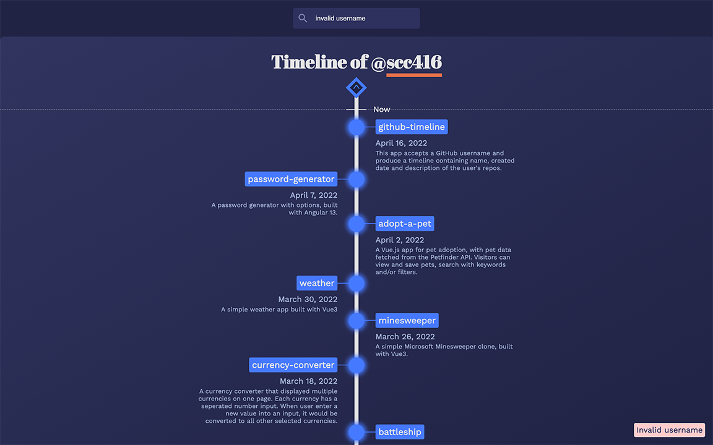

# GitHub Timeline

This app accepts a GitHub username and produce a timeline containing name, created date and description of the user's repos.

## Table of Content

- [Live Demo](#live-demo)
- [Final Product](#final-product)
- [Getting Started](#getting-started)
- [Dependencies](#dependencies)
- [Credit](#credit)

## Live demo

This project was deployed to [Netlify](https://www.netlify.com/):
https://the-github-timeline.netlify.app/

## Final Product

### Initial Layout

### Timeline

### Handle Error

### Loading

## Getting Started

1. Clone or download this repository onto your local device.
2. `cd` to the folder where this project is cloned.
3. Install all dependencies with `npm install` command.
4. Run the app in the development mode with `npm start` command.
5. Open the broswer and visit: [http://localhost:3000/](http://localhost:3000/).

## Dependencies

- [React](https://reactjs.org/)
- [Redux](https://redux.js.org)
- [Redux Thunk](https://github.com/reduxjs/redux-thunk)
- [React Redux](https://react-redux.js.org/)
- [Axios](https://axios-http.com/)
- [Moment.js](https://momentjs.com/)
- [Material Design Icons](https://materialdesignicons.com/): [@mdi/js](https://github.com/Templarian/MaterialDesign), [@mdi/react](https://github.com/Templarian/MaterialDesign-React)

## Credit

- [Design](https://www.behance.net/gallery/117986233/The-Timeline-Website) by [Polina Katasonova](https://www.behance.net/polypolya52336), [Pecode .](https://www.behance.net/pecodesoftware), [Yuliia Braslavska](https://www.behance.net/braslavska), [Myroslav Kroka](https://www.behance.net/myroslavkr5c50) & [Kris Andrushko](https://www.behance.net/Kris_Andrushko) on [Behance](https://www.behance.net/)
- [Favicons](https://www.flaticon.com/premium-icon/github_3488435) made by [IconsBox](https://www.flaticon.com/authors/iconsbox) from [www.flaticon.com](https://www.flaticon.com/).
